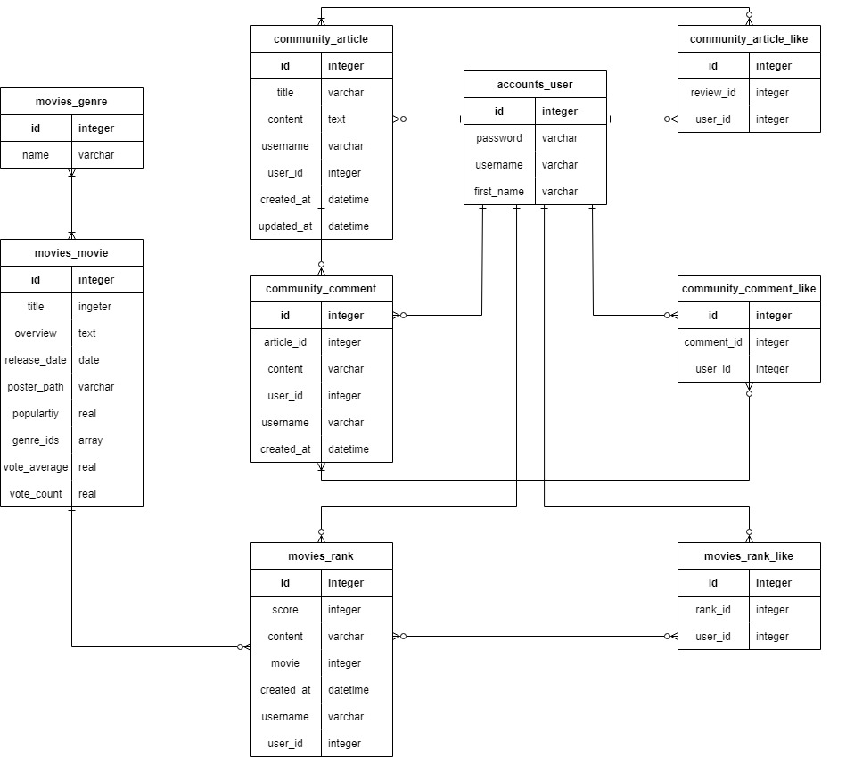
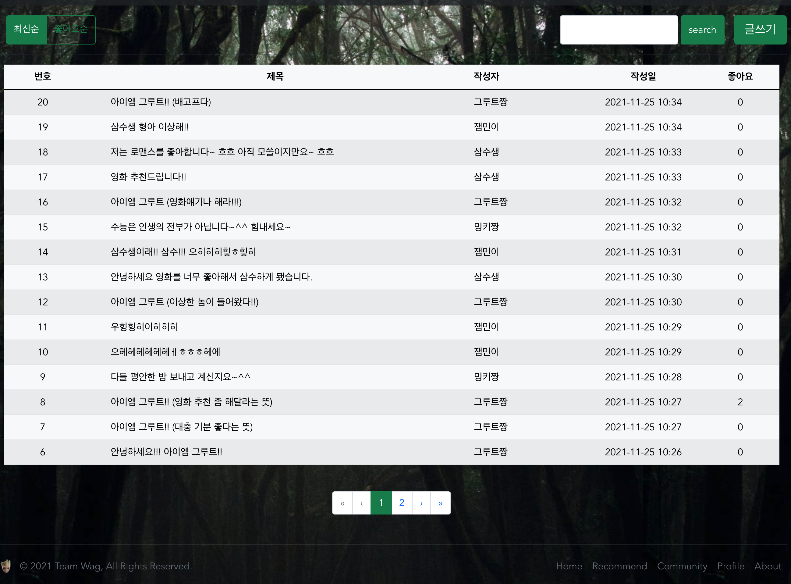

# 팀명: WAG : We Are Groot


### 00. 개요 및 실행

#### 개요

- 최근에 리뷰를 작성한 영화를 기반으로 새로운 영화를 추천하고 커뮤니티를 통해 영화에 대한 각종 이야기를 나눌 수 있는 웹 애플리케이션 제작

#### 실행

- front

  - ```bash
    npm install
    npm run serve
    ```

- back

  - ```bash
    pip install -r requirements.txt
    python manage.py makemigrations
    python manage.py migrate
    python manage.py loaddata data.json
    python manage.py runserver
    ```
    
    

### 01. 팀원 정보 및 업무 분담 내역

#### 팀원 정보

- 팀장: 서울 3반 최상진
- 팀원: 서울 3반 서민기

#### 업무 분담

- 최상진: front 담당 / Vue.js / Django REST API 활용 / 웹 디자인 / 데이터베이스 모델링
- 서민기: back 담당 / Django REST API 서버 구축 / 알고리즘 코딩 / 영화 데이터 가공


### 02. 목표 서비스 구현 및 실제 구현 정도

#### 목표 서비스

- 정보 기반 영화 추천 웹 애플리케이션
- 영화에 대한 평점과 간단한 리뷰 작성
- 영화에 대한 각종 정보와 이야기를 공유할 수 있는 커뮤니티

#### 실제 구현 정도

- 최근 리뷰를 작성한 영화를 기반으로 감독, 주연배우, 장르와 관련된 영화를 추천하는 알고리즘 구현
- 홈 페이지에서 영화리스트를 보고 영화에 대한 디테일 페이지에서 각 영화의 평점과 리뷰를 남길 수 있음
- 커뮤니티 페이지에서 글을 작성하고 좋아요 및 댓글 기능 구현


### 03. 데이터베이스 모델링(ERD)



### 04. 필수 기능

#### 관리자 뷰

- 관리자 권한의 유저가 영화 등록 / 수정 / 삭제 할 수 있음
- 관리자 권한의 유저만 유저 관리 권한을 가짐
- 장고에서 기본적으로 제공하는 admin 기능을 이용하여 구현

#### 회원가입 및 로그인

- Django의 User model을 이용하여 Vue.js에서 회원가입 및 로그인 폼을 만들어 기능 구현
- JWT토큰 방식으로 사용자 인증 구현

#### 영화정보

- TMDB사이트의 오픈API를 활용하여 데이터베이스 구축
- 인기순으로 정렬된 영화 1000개의 데이터를 받아와 주연배우, 감독에 대한 정보를 따로 API에 요청하여 데이터에 추가함
- 주연배우의 출연작과 감독의 작품을 다시 인기순으로 정렬하여 'filmography' key의 value 값으로 두개씩 추가
- 로그인 된 유저들은 각 영화에 대해 평점 등록 / 리뷰 작성 / 삭제 등을 할 수 있으며 마음에 드는 리뷰에 좋아요를 누르고 평점순이나 날짜순으로 정렬된 리뷰를 볼 수 있음

- 직접 구축한 Django REST API 서버에 요청을 보내 영화리스트를 받아 영화를 인기순 혹은 평점순으로 정렬하여 볼 수 있음
- 영화 제목을 키워드로 검색하여 결과를 보여줌

#### 추천 알고리즘

- 현재 갖고있는 영화 데이터베이스의 모든 영화에서 랜덤으로 5개 추천

- 마지막으로 평점을 등록한 영화를 기반으로 같은 장르의 영화 중 가장 인기있는 5편과 주연배우 2명의 인기작 각 2편, 감독의 인기작 2편을 모아 랜덤으로 5개 영화 추천

  

#### 커뮤니티

- 영화 정보와 관련된 대화를 나눌 수 있는 커뮤니티 기능 구현
- 로그인한 사용자만 글을 작성할 수 있으며 작성자 본인만 글을 수정 / 삭제 하도록 만듦
- 각 게시글에는 댓글을 작성할 수 있고 게시글에 대한 좋아요 및 댓글에 대한 좋아요 기능 구현
- 게시글 리스트를 최신순이나 좋아요순으로 정렬할 수 있고, 게시글에 대한 검색 기능을 추가함


### 05. 웹 페이지 

#### Home


#### 영화 추천


#### 영화 디테일


#### 커뮤니티




#### 프로필


### 06. 느낀점

- 최상진
  - 프로젝트를 진행하며 웹 사이트 개발에 있어 front-end 와 back-end의 개념과 역할에 대해서 잘 알게 되었다. vue.js와 django에 대해서 배우면서 각각의 활용법에 대해서는 알았지만 vue.js에서 요청을 보내고 django에서 요청을 받아 반환해주는 것에 대한 이해가 부족했었는데 직접 해보면서 원리와 구조에 대해 익숙해졌다. CSS에 재미를 느껴 front-end를 맡았지만 초반에는 vue.js가 익숙하지 않아서 요청을 보내고 받는데에 어려움을 느꼈다.  많은 시간을 소비하면서 계속해서 진행하면서 후반에는 더욱 수월하게 진행할 수 있었다.
    페이지 디자인에서는 bootstrap만 활용하였는데 기능 구현을 위해 처음으로 bootstrap-vue를 사용하였다. 기존에 썼던 bootstrap과는 조금 달라 어려웠지만 공식 페이지와 검색을 통해 기능구현과 디자인 모두 성공적으로 마무리 할 수 있었다.
    웹페이지 제작에 있어 어느 하나 쉬운 것이 없다고 느꼈고 조금은 부족한 웹 프로그래밍 실력이였지만 실질적으로 결과물을 내는 프로젝트를 진행하니 웹 제작의 전반적인 과정을 알게 되어 좋았고 눈앞의 결과물을 보니 스스로 웹 프로그래밍 실력도 향상한 것도 체감되어 뿌듯했다. 부족한 점에 대해서 배우고 스스로 학습히고 많은 것을 느낀 매우 만족스러운 첫 프로젝트였다.
- 서민기
  - 